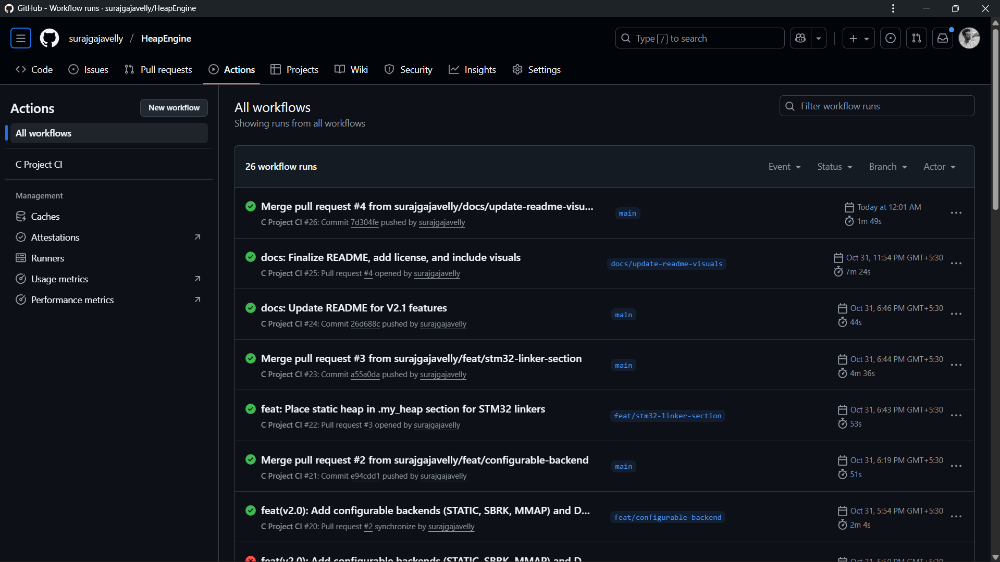
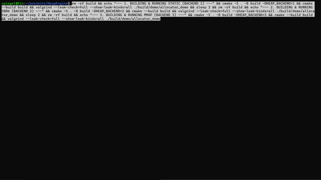

# HeapEngine: A Custom C Memory Allocator (V2.1)





This is a custom dynamic memory allocator (`malloc`, `free`, `calloc`, `realloc`)
written in C from scratch. It is built to be portable across standard OS
environments (Linux) and bare-metal embedded systems (like STM32).


The allocator is built using a TDD (Test-Driven Development) workflow,
is fully tested with the Unity framework, and is validated for memory
safety with Valgrind.

The allocator is designed to be **portable** and can be compiled to use:
1.  A **static array** (ideal for bare-metal STM32/embedded projects).
2.  `sbrk()` (for traditional Unix-like heap management).
3.  `mmap()` (for modern OS-level memory mapping).

## V2.1 Features

* **Configurable Backends:** The heap memory source can be selected at compile time (`STATIC`, `SBRK`, or `MMAP`) using a CMake option.
* **STM32 Linker Script Support:** The `STATIC` heap is placed in a `__attribute__((section(".my_heap")))`, allowing an STM32 linker script (`.ld`) to place the heap in a specific memory region (e.g., CCM RAM).
* **Docker Environment:** Includes a `Dockerfile` for a 100% reproducible build and test environment identical to the CI.
* **Robust CI/CD:** Automated checks via GitHub Actions for formatting (`clang-format`), static analysis (`cppcheck`), building, and memory leak/error checking (`valgrind`).

## V1.0 Core Features

* **Explicit Free List:** Manages free memory using a singly-linked list.
* **First-Fit Strategy:** Scans the free list and uses the first block that is large enough.
* **Block Splitting:** Splits large free blocks to reduce internal fragmentation.
* **Forward Coalescing:** `my_free` merges a freed block with the *next* physical block if it is also free.
* **Memory Alignment:** `my_malloc` returns memory aligned to **8 bytes**.
* **Robust Safety Checks:**
    * **Magic Numbers (`0xC0FFEE`):** Validates block headers to detect corruption.
    * **Boundary Checks:** `my_free` validates pointers against heap bounds.
    * **Double-Free Protection:** `my_free` detects and ignores attempts to free an already-freed block.
* **Full API:** Implements `my_malloc`, `my_free`, `my_calloc`, and `my_realloc`.
* **Testing:** Includes a full unit test suite (18 tests) using the **Unity** framework.

---

## Project Structure
This project follows a clean, professional, and scalable directory structure:
```
.
├── .github/
│   └── workflows/
│       └── ci.yml
├── .clang-format
├── .gitignore
├── CMakeLists.txt
├── Dockerfile
├── Doxyfile
├── LICENSE
├── README.md
├── assets/
│   ├── output.gif
│   └── ci.png
├── build/                     # CMake build output
├── demo/
│   ├── CMakeLists.txt
│   └── main.c
├── docs/                      # Doxygen-generated documentation
│   └── (Doxygen output)
├── include/
│   └── my_allocator.h
├── src/
│   └── my_allocator.c
├── tests/
│   ├── CMakeLists.txt
│   └── test_main.c
└── vendor/
    └── unity/                # Unity test framework
```
---
## 🛠️ Technology Stack & Workflow

| Category | Tool/Standard |
| :--- | :--- |
| Language | C (C11) |
| Build System | CMake |
| Testing | Unity |
| Code Style | clang-format (LLVM) |
| Static Analysis | cppcheck |
| Memory Debugging | Valgrind |
| Documentation | Doxygen |
| CI/CD | GitHub Actions |
| Environment | Docker (Ubuntu 22.04) |
| Version Control | Git (Feature Branch & PR Workflow) |

---

## How to Build

This project can be built natively on Linux or within the provided Docker container.

### Docker Build (Recommended)

This is the easiest and most reliable way to build, as it matches the CI environment.

1.  **Build the image:**
    ```bash
    docker build -t heap-engine-dev .
    ```
2.  **Run the build & tests (example using MMAP backend):**
    ```bash
    docker run --rm -v "$(pwd)":/app heap-engine-dev \
    /bin/bash -c "rm -rf build && \
                  cmake -S . -B build -DHEAP_BACKEND=3 && \
                  cmake --build build && \
                  ./build/tests/run_tests && \
                  valgrind ./build/demo/allocator_demo"
    ```
### Native Build (Linux / WSL)

1.  **Install Prerequisites:**
    ```bash
    sudo apt update && sudo apt install -y build-essential cmake valgrind
    ```
2.  **Clone the Repository:**
    ```bash
    git clone [https://github.com/surajgajavelly/HeapEngine.git](https://github.com/surajgajavelly/HeapEngine.git)
    cd HeapEngine
    ```
3.  **Configure CMake (Select Backend):**
    ```bash
    # To build with the default STATIC backend (for STM32 or general use):
    cmake -S . -B build
    
    # To build with the SBRK backend:
    cmake -S . -B build -DHEAP_BACKEND=2

    # To build with the MMAP backend:
    cmake -S . -B build -DHEAP_BACKEND=3
    ```
4.  **Build the project:**
    ```bash
    cmake --build build
    ```

---

## How to Test

After building, you can run the unit tests and the demo application.

1.  **Run Unit Tests:**
    ```bash
    ./build/tests/run_tests
    ```

2.  **Run Demo Application (with Valgrind):**
    ```bash
    valgrind --leak-check=full --show-leak-kinds=all ./build/demo/allocator_demo
    ```
    A successful run will show `ERROR SUMMARY: 0 errors` and `All heap blocks were freed`.

## Future Work

* **Backward Coalescing:** Implement full two-way coalescing (merging with the *previous* block) by adding footers/boundary tags.
* **Thread-Safety:** Add mutexes to protect the free list for use in an RTOS.
* **Dynamic Growth:** Enhance the `SBRK`/`MMAP` backends to request more memory from the OS if the free list is exhausted.

## Contributing
Contributions are what make the open-source community such an amazing place to learn, inspire, and create. Any contributions you make are **greatly appreciated**.

1. Fork the Project
2. Create your Feature Branch (`git checkout -b feature/AmazingFeature`)
3. Commit your Changes (`git commit -m 'feat: Add some AmazingFeature'`)
4. Push to the Branch (`git push origin feature/AmazingFeature`)
5. Open a Pull Request

## License
Distributed under the MIT License. See `LICENSE` for more information.